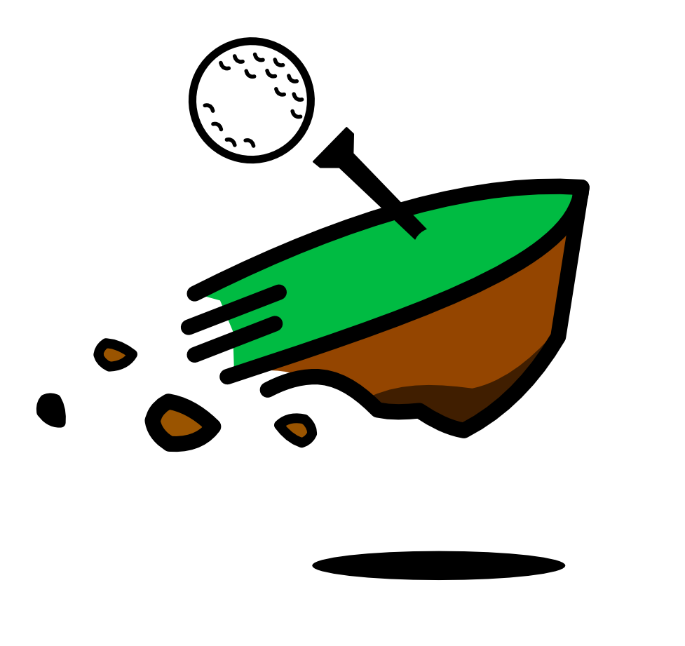

# ARE YOU DOWN TO GOLF?

___

+ ## TECHNOLOGIES USED
+ RUBY ON RAILS
+ POSTRGRES
+ FOUNDATION
+ JAVASCRIPT
+ JQUERY
+ HTML
+ SASS
+ GIT

+ ## GEMS/API
+ RATY RATE
+ GOOGLE MAP API
+ OPEN WEATHER APP
+ DEVISE
+ BRAINTREE
+ RAILS ERD
+ GON
+ FIGARO
+ CLOUDINARY
+ GRAVATAR
+ MAILBOXER
+ WILL_PAGINATE

### MILESTONES

Don't forget to rake your routes 😉

Eric's Gem of Code 😎

Jonathan Gets Hacky with Google Maps

## What this app does:

##### This app solves the ‘lonely golfer issue’ by giving our users a chance to browse golf courses and matches created by other users in the bay area.

##### When you log into our app, you will be given the option to login or sign up.(NOT CONSIDERING PRO ACCT) Once a user does that, he/she will be directed to our matches index pages that displays a list of matches being held by other users(moderators). The user has a chance to join by their preference of golf course or users in the match.

##### After creating or joining a match, a user is allowed to view the match on the map show page a see a bevy of information, including a picture of the golf course, time/date, name of match(ex. Jonathan’s Nine Hole for Sunday), users involved and also a map to the golf course where the match is being held, and comments being posted by users that may want to join and users that have already joined.

##### A user will experience the look and feel of a single page app (SPA) by having every form conveniently in a modal. With an exception of the comment form on the match show page.

##### A user may edit or view their profile on the profile show page, but may not search or view other users profiles. If a user did not choose to log in or sign up, they are allowed to surf the golf courses that we are affiliated with but may not view the matches index page. However they may view the golf courses index/show page and see what matches are being held or upcoming on that particular course, including the users joined in that match.

##### Down2Golf free allows you as a user to join one match at a time. For our stretch we will only allow pro users to create matches. Fee users may only join those matches, however they are limited to one a time.

### USER STORY
+ A user should be able to sign up as free or premium.
+ A user should be able to create matches.
+ A user should be able to join matches.
+ A user should be able to view matches that he’s joined.
+ A user should be able to view all golf courses.
+ A user should be able to message other users.
+ A user should be able to leave ratings for golf courses.
+ A user should be able to comment on a match or course.

### SPECIAL THANKS TO
### EVERYONE, GOODLUCK!

<iframe width="560" height="315" src="https://www.youtube.com/embed/izGwDsrQ1eQ" frameborder="0" allowfullscreen></iframe>
